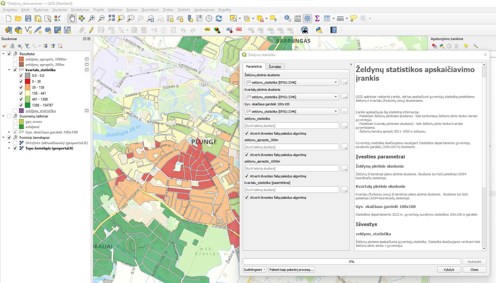

# Želdynų statistikos apskaičiavimo GIS įrankis

QGIS aplinkoje veikiantis įrankis, skirtas apskaičiuoti gyventojų statistiką pateiktiems želdynų ir kvartalų (funkcinių zonų) sluoksniams. 

Įrankis apskaičiuoja šią statistinę informaciją:
* Pateiktam želdynų plotiniam sluoksniui - kiek konkretaus želdyno ploto tenka vienam gyventojui 300 ir 1000 m atstumu;
* Pateiktam kvartalų plotiniam sluoksniui - kiek želdynų ploto tenka kvartalo gyventojams 300 ir 1000 m atstumu;
* Želdynų bendrą aprėptį 300 ir 1000 m atstumu.

Gyventojų statistika skaičiuojama naudojant Statistikos departamento gyventojų surašymo gardelių (100x100 m) duomenis.

## Statistikos apskaičiavimo algoritmas

Pagrindiniai erdvinių duomenų analizės algoritmo žingsniai:
1. Nurodytu spinduliu nuo želdynų apskaičiuojama, kiek jiems tenka gyventojų pagal Statistikos departamento gyventojų gardelės duomenis;
2. Apskaičiuojama kiek želdynų ploto tenka 1 gyventojui padalintus želdyno plotą iš gyventojų skaičiaus nurodytame spindulyje;
3. Gauta želdynų statistika sukertama su gyvenamųjų kvartalų (zonų) sluoksniu nurodytu spinduliu;
4. Susumuojama, koks bendras želdynų plotas tenka 1 gyventojui kvartale.

Konstantos:
* Statistikos skaičiavimo spindulys - 300 ir 1000 m
* Statistikos gardelės gyventojų skaičius skaičiuojama pagal POP atributą
* Visi kiti erdvinių duomenų matmenys išsiskaičiuojami (tame tarpe ir želdynų plotai)

## Įrankio naudojimas

Kaip pasinaudoti įrankius:
1. Atsidarykite QGIS ir jame atsidarykite Naršyklės skiltį;
2. Naviguokite iki am-zeldynai-calculation.gpkg failo;
3. Atsidarykite Zeldynu_skaiciavimas žemėlapio projektą;
4. Atsidarykite Želdynų statistika įrankį;
5. Nurodykite savo turimus želdynų, kvartalų sluoksnius bei pasirinkite statistiko gardelių duomenis (jie pridėti žemėlapyje kaip sluoksnis);
6. Jums bus sugeneruoti 4 sluoksniai: želdynų statistika, kvartalų statistika ir želdynų aprėptys 300 ir 1000 m spinduliu.
