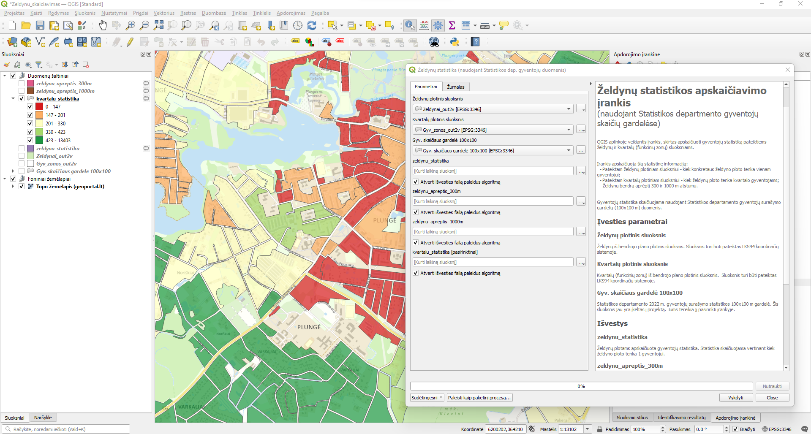

# Želdynų statistikos apskaičiavimo GIS įrankis

## Apie įrankį

QGIS aplinkoje veikiantis įrankis, skirtas apskaičiuoti gyventojų statistiką pateiktiems želdynų ir kvartalų (funkcinių zonų) sluoksniams. 

Įrankis apskaičiuoja šią statistinę informaciją:
* Pateiktam želdynų plotiniam sluoksniui - kiek konkretaus želdyno ploto tenka vienam gyventojui 300 ir 1000 m atstumu. Želdynams, kurių plotas <b>mažesnis nei 1 ha</b>, statistika 1000 m atstumu neaskaičiuojama;
* Pateiktam kvartalų plotiniam sluoksniui - kiek želdynų ploto tenka kvartalo gyventojams 300 ir 1000 m atstumu;
* Želdynų bendrą aprėptį 300 ir 1000 m atstumu.

Įrankis turi dvi versijas, skaičiuoti želdynų statistika naudojant skirtingą gyventojų skaičiaus statistikos šaltinį:
* Želdynų statistika (naudojant Statistikos dep. gyventojų duomenis) - gyventojų statistikai naudojami Statistikos departamento gyventojų surašymo gardelių (100x100 m) duomenis;
* Želdynų statistika (naudojant BP gyventojų duomenis) - gyventojų statistikai naudojami Jūsų nurodyto sluoksnio gyventojų skaičiaus atributas. Tai gali būtų pvz. Bendrojo plano kvartalų sluoksnis su planuojamu gyventojų skaičiumi, arba jeigu norima paskaičiuoti statistika gardelėms, ne kvartalams - galima nurodyti ir Statistikos gardelių sluoksnį.

Įrankis rezultatus pateikia kaip 4 sluoksnius su šia pagrindine atributine informacija:
* zeldynu_statistika - sluoksnis, kuris Jūsų pateiktam želdynui sluoksniui suskaičiuoja šią statistiką:
    * calc_gyv_sk_300 - gyventojų skaičių 300 m atstumu;
    * calc_gyv_sk_1000 - gyventojų skaičių 1000 m atstumu;
    * calc_plotas_kv_m - želdyno plotą kv. m;
    * calc_plot_kv_m_1gyv_300 - želdyno plotas kv. m tenkantis 1 gyventojui (skaičiuojant 300 m atstumu);
    * calc_plot_kv_m_1gyv_1000 - želdyno plotas kv. m tenkantis 1 gyventojui (skaičiuojant 1000 m atstumu);
* kvartalu_statistika - sluoksnis, kuris Jūsų pateiktam kvartalų sluoksniui suskaičiuoja šią statistiką:
    * calc_sum_z_kv_m_300 - kiek želdynų ploto kv. m tenka kvartalo 1 gyventojui (skaičiuojant 300 atstumu). Skaičiavimui naudojama zeldynu_statistika sluoksnyje jau apskaičiuota želdyno ploto kv. m tenkančio 1 gyventojui statistika; 
    * calc_sum_z_kv_m_1000 - kiek želdynų ploto kv. m tenka kvartalo 1 gyventojui (skaičiuojant 1000 atstumu). Skaičiavimui naudojama zeldynu_statistika sluoksnyje jau apskaičiuota želdyno ploto kv. m tenkančio 1 gyventojui statistika; 
* zeldynu_apreptis_300 - buferis aplink visus želdynus apjungtas į vientisą daugiakampį ir žymintis jūsų nurodyto želdynų sluoksnio objektų aprėptį 300 m atstumu;
* zeldynu_apreptis_1000 - buferis aplink visus želdynus apjungtas į vientisą daugiakampį ir žymintis jūsų nurodyto želdynų sluoksnio objektų aprėptį 1000 m atstumu. 

Įrankio veikimas testuotas naujausioje <b>QGIS versijoje 3.26</b>. [Atsisiųskite QGIS](https://qgis.org/en/site/forusers/download.html) ir naudokitės nemokamai ne tik taikydami šį įrankį, bet ir atlikdami kasdienius GIS darbus. Susipažinkite su QGIS taikymo [pradžiamokslio video medžiaga](https://www.youtube.com/playlist?list=PLKmmiYTWtpG34YfCav9GdL5HZ5abXFmaR) (Mokomųjų filmų ciklas „GIS taikymas gamtosaugoje“).

## Įrankio naudojimas

Kaip pasinaudoti įrankius:
1. Atsidarykite QGIS ir jame atsidarykite Naršyklės skiltį;
2. Naviguokite iki am-zeldynai-calculation.gpkg failo;
3. Atsidarykite Zeldynu_skaiciavimas žemėlapio projektą;
4. Atsidarykite projekto Apdorojimo įrankinę ir pasirinkite Projekto modeliai;
5. Pasirinkite norimą įrankį;
5. Priklausomai nuo pasirinkto įrankio nurodykite savo turimus želdynų, kvartalų sluoksnius bei pasirinkite statistiko gardelių duomenis (jie pridėti žemėlapyje kaip sluoksnis);
6. Jums bus sugeneruoti 4 sluoksniai: želdynų statistika, kvartalų statistika ir želdynų aprėptys 300 ir 1000 m spinduliu.

Susipažinkite su įrankio taikymo video pradžiamoksliu:

Susipažinkite su dažniausiai užduodamais įrankio naudojimo klausimais [DUK skiltyje](docs/faq/README.md).

## Statistikos apskaičiavimo algoritmas

Pagrindiniai erdvinių duomenų analizės algoritmo žingsniai:
1. Nurodytu spinduliu nuo želdynų apskaičiuojama, kiek jiems tenka gyventojų pagal Statistikos departamento gyventojų gardelės duomenis arba Jūsų nurodyto sluoksnio gyventojų statistiką;
2. Apskaičiuojama kiek želdynų ploto tenka 1 gyventojui padalintus želdyno plotą iš gyventojų skaičiaus nurodytame spindulyje;
3. Gauta želdynų statistika sukertama su gyvenamųjų kvartalų (zonų) sluoksniu nurodytu spinduliu;
4. Susumuojama, koks bendras želdynų plotas tenka 1 gyventojui kvartale.

Konstantos:
* Statistikos skaičiavimo spindulys - 300 ir 1000 m;
* Želdyno plotas, kuriam neskaičiuojama statistika 1000 m atstumu - 1 ha;
* Statistikos gardelės gyventojų skaičius skaičiuojama pagal POP atributą;
* Visi kiti erdvinių duomenų matmenys išsiskaičiuojami (tame tarpe ir želdynų plotai).
