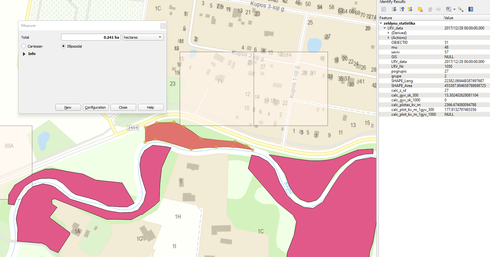

# Dažniausiai užduodami klausimai

## Statistikos rezultatai

> Daugumai mažų miško plotų gyventojų skaičius gyvenantis 1000 m atstumu yra suskaičiuotas kaip 0, nors Statistikos departamento duomenys rodo visai ką kitą? Atitinkamai neteisingai suskaičiuojama ir kv. m gyventojui statistika.

Kaip ir nurodyta apraše, statistikos skaičiavime taikoma AM  nurodyta taisyklė - želdynams, kurių plotas mažesnis nei 1 ha, statistika 1000 m atstumu neskaičiuojama. Todėl plotams, mažesniems nei 1 ha, skaičiuojant želdynų statistiką nepriskiriamas gyventojų skaičius, kad jie nedalyvautų tolesniuose normos skaičiavimuose. 

